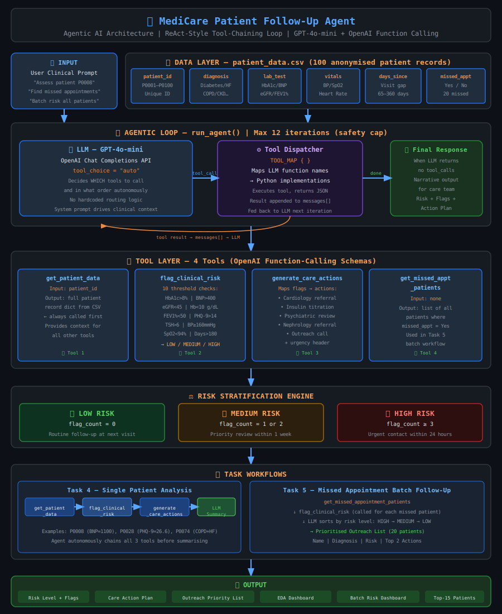
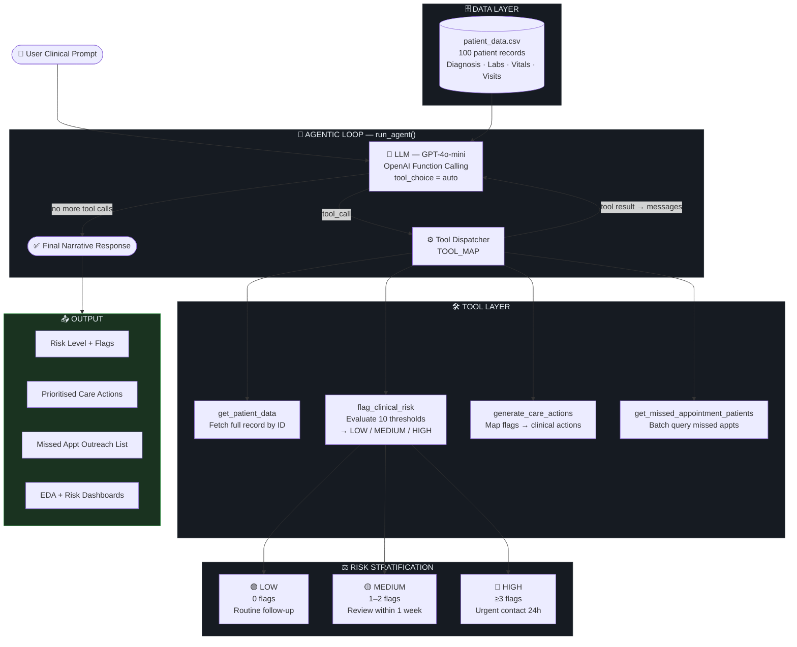

# 🏥 MediCare Patient Follow-Up Agent

> **Data Scientist Assessment — Agentic AI Prototype**

An AI agent that autonomously orchestrates tool calls to analyse 100 chronic disease patient records, flag clinical risks, and generate prioritised follow-up care actions.

---

## 📋 Overview

**MediCare Clinic** manages over 1,000 chronic disease patients. This prototype deploys an AI-powered agent that autonomously reviews patient records, identifies those at risk, and generates prioritised action plans for the care coordination team.

| Domain | Role | Format |
|--------|------|--------|
| Healthcare | Data Scientist | Jupyter Notebook + CSV |

---

## 🗂️ Files

| File | Description |
|------|-------------|
| `medicare_followup_agent.ipynb` | Main Jupyter Notebook — all 5 tasks |
| `patient_data.csv` | 100 anonymised patient records |

---

## 🏗️ Architecture Diagram



---

## 🤖 Agent Architecture (Flow)



---

## 🛠️ Tools Defined

| Tool | Description |
|------|-------------|
| `get_patient_data` | Fetch complete clinical record by patient ID |
| `flag_clinical_risk` | Evaluate lab values & vitals → LOW / MEDIUM / HIGH risk |
| `generate_care_actions` | Generate prioritised follow-up care actions |
| `get_missed_appointment_patients` | Return all patients who missed their last appointment |

---

## 📊 Clinical Risk Thresholds

| Lab Test | Threshold | Condition |
|----------|-----------|-----------|
| HbA1c | > 8.0% | Poor glycaemic control |
| BNP | > 400 pg/mL | Elevated heart failure marker |
| eGFR | < 45 mL/min | Reduced kidney function |
| Hemoglobin | < 10 g/dL | Significant anaemia |
| FEV1% | < 50% | Severe airflow obstruction |
| Peak Flow | < 320 L/min | Reduced respiratory function |
| PHQ-9 | > 14/27 | Moderate-severe depression |
| TSH | > 6.0 mIU/L | Undertreated hypothyroidism |
| Systolic BP (vitals) | ≥ 160 mmHg | Severely elevated BP |
| SpO2 | < 94% | Low oxygen saturation |

**Risk stratification:** 🔴 HIGH (≥3 flags) · 🟡 MEDIUM (1–2 flags) · 🟢 LOW (0 flags)

---

## 📝 Tasks Completed

- **Task 1** — Data Loading & Exploratory Analysis (6-panel EDA dashboard)
- **Task 2** — Define Agent Tools (4 tools with OpenAI function-calling schemas)
- **Task 3** — Implement the Agentic Loop (ReAct-style autonomous tool-chaining)
- **Task 4** — Single Patient Analysis (3 example patients)
- **Task 5** — Missed Appointment Follow-Up (batch risk assessment + prioritised outreach list)
- **Bonus** — Batch Risk Dashboard (all 100 patients, 3-panel visualisation)

---

## 🚀 Setup & Running

### 1. Install dependencies
```bash
pip install openai pandas matplotlib seaborn
```

### 2. Set your OpenAI API key
```bash
# Windows PowerShell
$env:OPENAI_API_KEY = "sk-your-key-here"

# macOS / Linux
export OPENAI_API_KEY="sk-your-key-here"
```

### 3. Launch Jupyter and run all cells
```bash
jupyter notebook medicare_followup_agent.ipynb
```

> The notebook uses `gpt-4o-mini` by default. Change `MODEL` in the API key cell to `gpt-4o` for higher accuracy.

---

## ⚠️ Disclaimer

This is a **prototype** for assessment purposes. All clinical decisions must be validated by qualified healthcare professionals.
